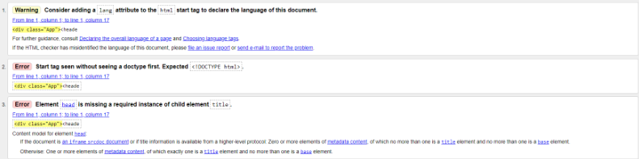

Lancer le projet
Une fois que vous avez cloné le repository github dans un dossier local, vous pouvez lancer la commande suivante dans votre terminal :

npm start

CodeSandBox
Vous pouvez accéder au projet sur CodeSandBox en cliquant sur ce lien : https://codesandbox.io/p/github/Diablo5929/Portfolio--John-Doe/main?file=%2F.codesandbox%2Ftasks.json&workspaceId=d0df9829-19f8-49ef-9de7-e440a4f3d69b

Voici une capture d'écran de la validation W3C
image

